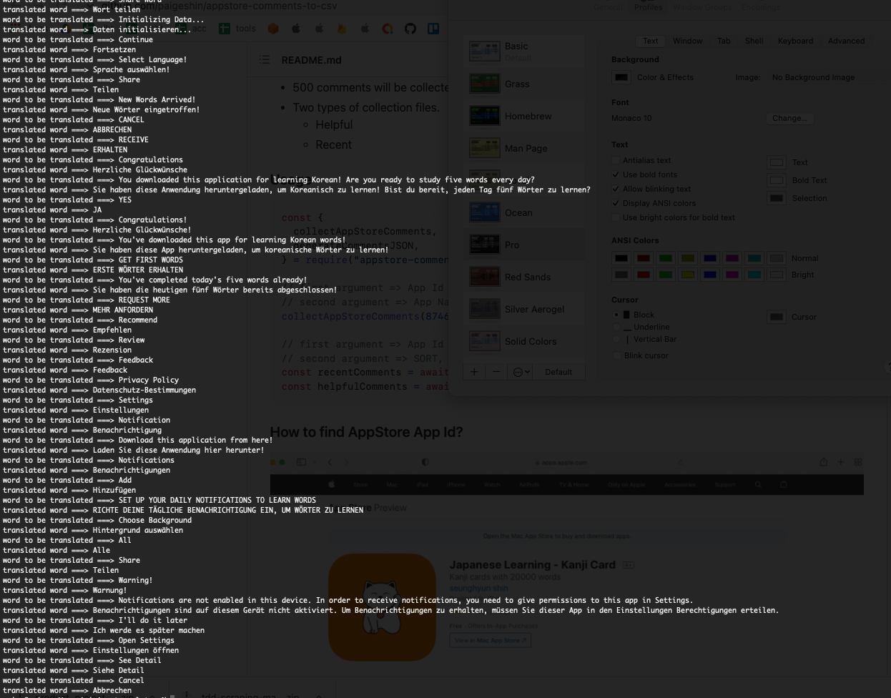
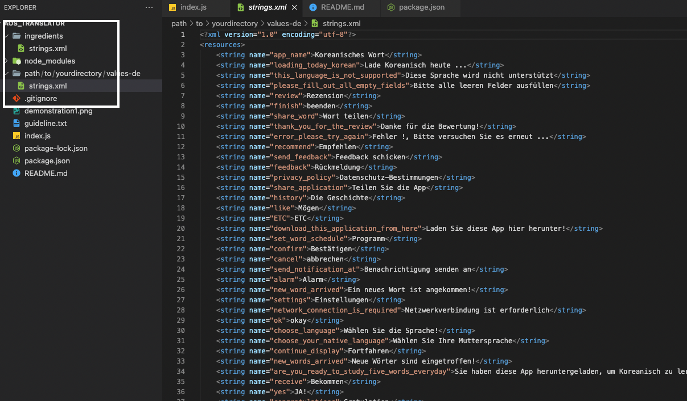
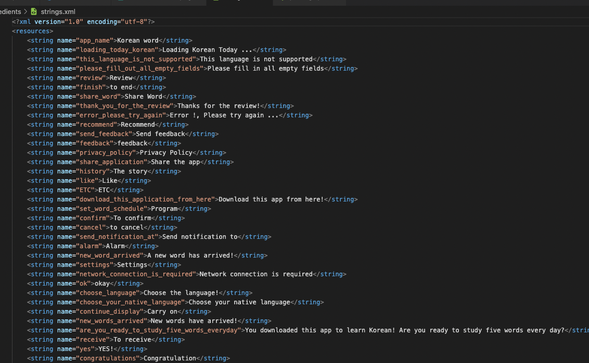

### Install

```bash
    npm install aos_translator
```

### Description

- Translation is executed upon Google Cloud.
- Translation quality wholly depends on Google Translate API
- Generate `strings.xml`

### Features

- translate

  - translate single word or phrase or sentence

- listAvailableLanguages

  - fetch all available language lists for translation
  - returns json objects list for customization

- generateXMLStrings

  - generate strings.xml for various languages
  - returns json objects list for cutomization

### Prepare

- strings.xml must be provided as input



### Usage

```jsx
const fs = require("fs");
const aosTranslator = require("aos_translator");

const jsonData = fs.readFileSync(
  "./your_google_service_account_credential.json"
);
const credential = JSON.parse(jsonData);

aosTranslator.configure({
  googleApiCredential: credential,
  googleApiProjectId: credential.project_id,
  log: false,
});

const options = {
  input: "./path/to/strings.xml",
  output: "./path/to/yourdirectory",
  from: "en",
  to: ["de", "fr"],
};

async function main() {
  const translatedJSON = await aosTranslator.generateXMLStrings(options);
}

main();
```

### Configure

1. Create your google account
2. Enable Google Translate API
3. Create Service Account
4. Get json credential

```jsx
const fs = require("fs");
const aosTranslator = require("aos_translator");

const jsonData = fs.readFileSync(
  "./your_google_service_account_credential.json"
);
const credential = JSON.parse(jsonData);

aosTranslator.configure({
  googleApiCredential: credential,
  googleApiProjectId: credential.project_id,
  log: false,
});
```

### generateXMLStrings

- Options

  - input => where your original file is

  - output => where your output files will be

  - from => indicate your original language

    example) "hello world" is english

  - to => provide your target languages

    example) if you provide these languages, ["de", "fr"], your strings.xml will be translated into german and french

```jsx
const fs = require("fs");
const aosTranslator = require("aos_translator");

const jsonData = fs.readFileSync(
  "./your_google_service_account_credential.json"
);
const credential = JSON.parse(jsonData);

aosTranslator.configure({
  googleApiCredential: credential,
  googleApiProjectId: credential.project_id,
  log: false,
});

const options = {
  input: "./path/to/strings.xml",
  output: "./path/to/yourdirectory",
  from: "en",
  to: ["de", "fr"],
};
const translatedJSON = await aosTranslator.generateXMLStrings(options);
```

### Code Example - all features

```jsx
// Configure
const fs = require("fs");
const aosTranslator = require("aos_translator");

const jsonData = fs.readFileSync(
  "./your_google_service_account_credential.json"
);
const credential = JSON.parse(jsonData);

aosTranslator.configure({
  googleApiCredential: credential,
  googleApiProjectId: credential.project_id,
  log: false,
});

// returns 'bonjour'
const result = await aosTranslator.translate("hello", { from: "en", to: "fr" });

// returns objects (available languages for translation), [{ code: 'tk', name: 'Turkmen' }, { code: 'uk', name: 'Ukrainian' },]
const result = await aosTranslator.listAvailableLanguages();

// returns objects and generate `strings.xml`
// Object will look like this
/*
    {
        "ko": {
            "key": "hello",
            "value": "안녕하세요"
        }
    }
*/
const options = {
  input: "./path/to/strings.xml",
  output: "./path/to/yourdirectory",
  from: "en",
  to: ["de", "fr"],
};
const translatedJSON = await aosTranslator.generateXMLStrings(options);
```
